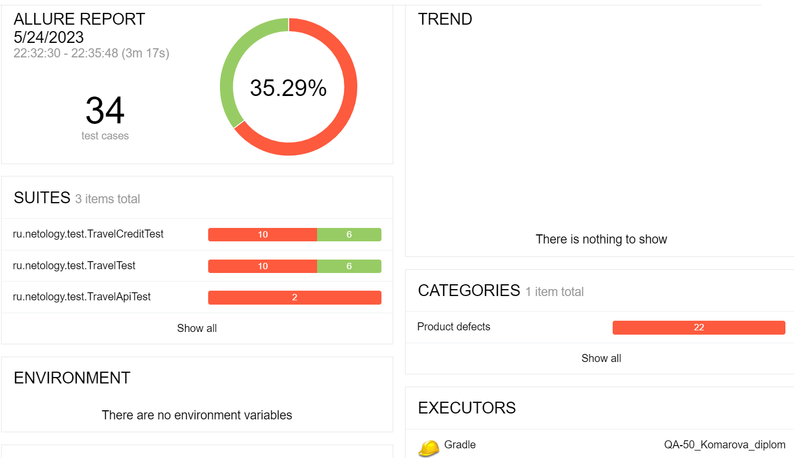
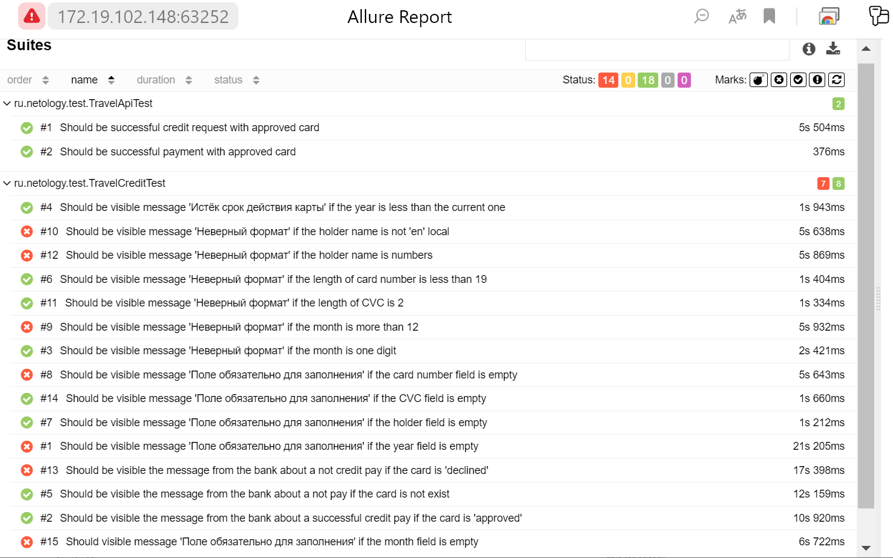
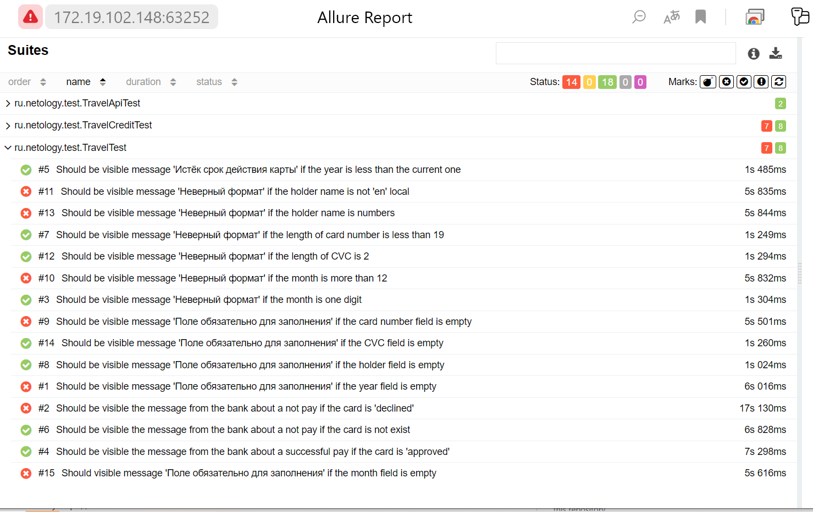

### Итоги автоматизированного тестирования
#### Краткое описание
Автоматизированы запланированные (_Plan.md_) позитивные и негативные сценарии покупки тура.

Разработаны тесты:
* UI-тесты - классы _TravelTest, TravelCreditTest_;
* API-тесты - класс _TravelApiTest_;
* по результатам прогона тестов получены репорты Allure.
#### Общее количество тест-кейсов: 32.
* _TravelTest_ - 15,
* _TravelCreditTest - 15,
* _TravelApiTest_ - 2.
#### Процент успешных и не успешных тест-кейсов: 56% успешных, 44%.
* _TravelTest_ - 53% успешных, 47% неуспешных,
* _TravelCreditTest_ - 53% успешных, 47% неуспешных,,
* _TravelApiTest_ - 100% успешных.

Репорты Allure:

#### Bag-репорты: открыты 4 issues.
* [В поле "Владелец" можно ввести цифры, любые знаки, буквы не латинского алфавита в неограниченном количестве #1](https://github.com/KomarovaN/QA50-diplom/issues/1),
* [В поле "Месяц" можно ввести значение больше 12 #2](https://github.com/KomarovaN/QA50-diplom/issues/2),
* [Если поля "Месяц" и "Номер карты" пустые, то выводится сообщение "Неверный формат" вместо сообщения "Поле обязательно для заполнения" #5](https://github.com/KomarovaN/QA50-diplom/issues/5).
* [Отображается сообщение банка об успешной оплате при вводе номера заблокированной карты на странице "Оплата по карте" и на странице "Купить в кредит" #6](https://github.com/KomarovaN/QA-50_Komarova_diplom/issues/6).

